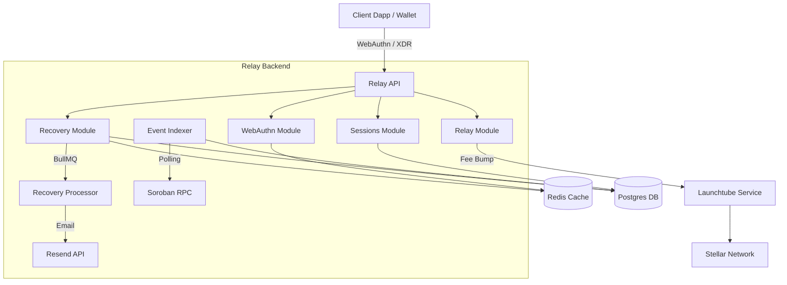

  <h1 align="center">Rayos Relay Backend</h1>
  

    <strong>Gasless transactions, session keys, and social recovery orchestration for Soroban.</strong>
  

  

    
  

---

## 📖 Overview

The **Rayos Relay Backend** is a NestJS-based orchestration layer for the Rayos smart wallet ecosystem on the Stellar/Soroban network. It acts as an off-chain coordinator to abstract away blockchain complexities from the end user.

**Key Features:**
- **Passkey Orchestration**: Handles WebAuthn registration and assertion ceremonies, securely caching challenges.
- **Gas Sponsoring**: Wraps user-signed XDRs in fee-bump transactions using [Launchtube](https://launchtube.io/) to provide a gasless experience.
- **Session Key Management**: Fast, off-chain tracking of temporary session keys mirroring on-chain states for seamless dapp integrations.
- **Social Recovery**: A BullMQ-powered orchestration engine that notifies guardians via email, aggregates approvals, enforces timelocks, and executes wallet recovery on-chain.
- **Indexer**: Listens to Soroban RPC events to dynamically map newly registered passkeys to smart wallet addresses.

## 🏗 Architecture

## 🛠 Tech Stack
- **Framework**: [NestJS](https://nestjs.com/) (Node.js/TypeScript)
- **Database**: [PostgreSQL](https://postgresql.org/) (via [Neon Serverless](https://neon.tech/))
- **ORM**: [Drizzle ORM](https://orm.drizzle.team/)
- **Queue & Caching**: [Redis](https://redis.io/) + [BullMQ](https://docs.bullmq.io/)
- **Validation**: [Zod](https://zod.dev/)
- **WebAuthn**: [@simplewebauthn/server](https://simplewebauthn.dev/)
- **Stellar SDK**: [@stellar/stellar-sdk](https://github.com/stellar/js-stellar-sdk)
- **Deployment**: [Render](https://render.com/)

## 🚀 Deployment

The backend is configured for simple, free-tier deployment on **Render**.

1. Fork this repository.
2. Connect your repo in the [Render Dashboard](https://dashboard.render.com/) as a new "Web Service".
3. Render will automatically read the `render.yaml` file in this repository.
4. Fill in the required Environment Variables in the Render dashboard.

> **Note**: Render free-tier services spin down after 15 minutes of inactivity. This repository includes a GitHub Action (`.github/workflows/keepalive.yml`) that pings the service every 10 minutes to keep it awake automatically.

*Live Testnet URL:* `https://<YOUR-RENDER-APP>.onrender.com/api`

## 📚 Documentation

Detailed documentation is available in the `docs/` directory:

- [Setup Guide](./docs/SETUP.md): Instructions for running the backend locally with Docker.
- [Trust Model & Security](./docs/TRUST.md): Learn why the relay is trustless and cannot steal funds.
- [Contributing Guidelines](./docs/CONTRIBUTING.md): How to contribute code to the relay.
- [Security Policy](./docs/SECURITY.md): How to report vulnerabilities.

### API Reference
When the server is running, an interactive **Swagger / OpenAPI** documentation is available at:
`http://localhost:3000/api/docs`

## 📄 License

This project is licensed under the MIT License.
